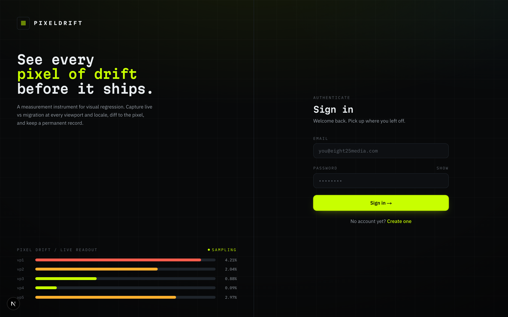
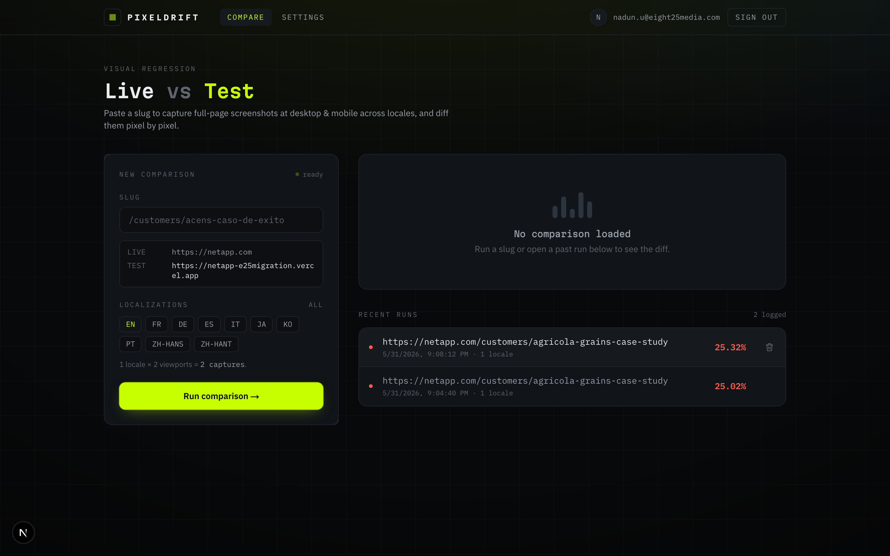
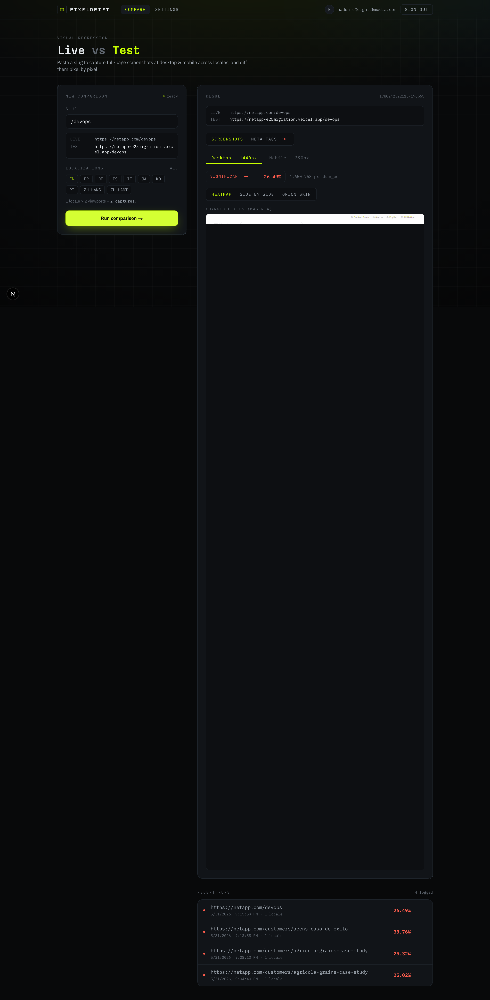
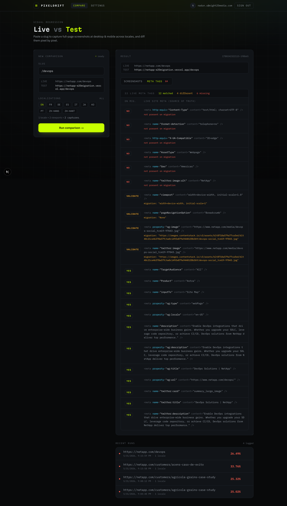
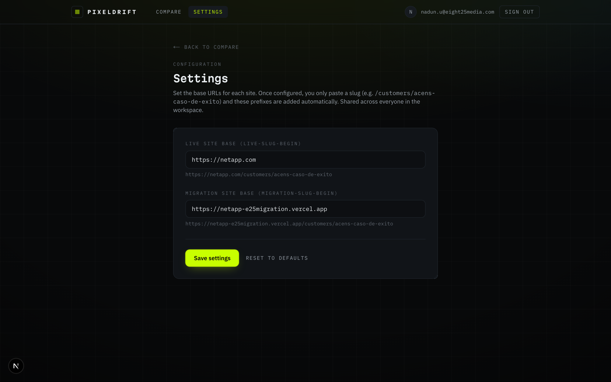

# PIXELDRIFT — Visual QA Tool

Compare a **live** website against a **migration/test** website, side by side.
For any page you give it, PixelDrift captures full-page screenshots at **desktop
and mobile**, shows you exactly which pixels changed, and checks whether the
migration's **meta tags** match the live site. Use it to catch visual and SEO
regressions before a migration goes live.

> [!IMPORTANT]
> **To run this locally you need the secret config file (`.env.local`).**
> It is **not** in the repo (it holds database and API keys). **Ask
> [Nadun Nissanka](mailto:nadun.u@eight25media.com) for the `.env.local`
> values** and drop the file in the project root before starting. Without it the
> app won't connect to the database, sign-in, or storage, and nothing will work.

---

## What it looks like

**Sign in** — the tool is behind a login. Use the account credentials Nadun gives
you (or create your own from the *Create one* link).



**Home** — paste a slug, pick which localizations to test, and run.



**Result — Screenshots** — a pixel-diff heatmap (magenta = changed), plus
side-by-side and onion-skin views, with a difference score per viewport.



**Result — Meta tags** — every meta tag on the **live** site (the source of
truth) with a status for the migration: **Yes** (matches), **Validate** (exists
but the value differs — check it), or **No** (missing).



---

## First-time setup (step by step)

You only do steps 1–4 once.

1. **Install [Node.js](https://nodejs.org/) 20 or newer.** Check with:
   ```bash
   node -v
   ```
2. **Install the project dependencies** (run this inside the project folder):
   ```bash
   npm install
   ```
3. **Install the browser** the tool uses to take screenshots:
   ```bash
   npm run pw:install
   ```
4. **Add the secret config.** Create a file named `.env.local` in the project
   root and paste the values **from Nadun Nissanka** into it. (See the important
   note at the top — the app cannot run without this.)
5. **Start the app:**
   ```bash
   npm run dev
   ```
6. Open **http://localhost:3000** in your browser and sign in.

---

## How to use it (the basics)

### 1. Set your base URLs once (Settings)

Click **Settings** (top right). Enter the base URL of the **live** site and the
**migration** site — e.g. `https://netapp.com` and
`https://netapp-e25migration.vercel.app`. Click **Save settings**.



Now you never have to type full URLs again — you just paste the part after the
domain (the "slug").

### 2. Run a comparison

On the home page:

1. **Slug** — paste the path of the page you want to check, e.g.
   `/customers/acens-caso-de-exito`. The tool shows you the exact **Live** and
   **Test** URLs it will compare so you can double-check them.
2. **Localizations** — pick the language versions to test (`en` is the default).
   Each one adds its prefix to the URL (e.g. `/it/...` for Italian). Tip: each
   locale runs both desktop **and** mobile, so more locales = a longer run.
3. Click **Run comparison**. Capturing full pages can take up to a minute per
   site, so give it a moment.

### 3. Read the results

When the run finishes, the right side shows the **Result** panel with two tabs:

- **Screenshots** — pick a viewport (Desktop / Mobile) and a view:
  - **Heatmap** — changed pixels are highlighted in magenta.
  - **Side by side** — live and test next to each other.
  - **Onion skin** — drag the slider to fade between live and test to spot
    layout shifts.
  - The **difference score** (e.g. `26.49%`) tells you how much changed. Green =
    a close match, amber = minor, red = significant.
- **Meta tags** — a table of the live site's meta tags with **Yes / Validate /
  No** for the migration. A red number on the tab tells you how many need
  attention.

> A note on the diff %: pages of different heights are padded to the taller size
> before comparing, so a big height difference can inflate the percentage. Use
> **side-by-side** and **onion-skin** to judge real layout changes.

### 4. Recent runs

Every comparison is saved under **Recent runs**. Click any row to re-open its
results (no need to run it again). Hover a row and click the **trash icon** to
delete a run — you'll be asked to confirm first.

---

## Heads up: bot protection

Some live sites (anything behind **Akamai**, including `netapp.com`) block
automated/headless browsers and return an *"Access Denied"* page. To get around
this, the tool launches a **real, visible Chrome window** while it captures — so
**a browser window will briefly pop open during each run. That's expected**,
don't close it. If a page is still blocked or needs a login, that one panel
shows a capture error instead of crashing the whole run.

To force the faster headless mode (fine for sites without bot protection):

```bash
HEADLESS=true npm run dev
```

---

## Under the hood (for the curious)

- **Next.js** app with **Supabase** (database, auth, screenshot storage) via
  **Prisma**.
- `app/api/compare/route.ts` — launches Chromium, captures both pages per locale
  per viewport, diffs them, uploads screenshots, runs the meta-tag check, and
  saves the run.
- `lib/capture.ts` / `lib/prepare.ts` — take each screenshot and clean the page
  first (disable animations, **hide cookie/consent popups**, trigger lazy-loaded
  content, wait for fonts).
- `lib/diff.ts` — pixel comparison via `pixelmatch`.
- `lib/meta.ts` — fetches both pages' HTML and compares their meta tags.

See `specs/` for design notes (including the plan to deploy on Vercel).
